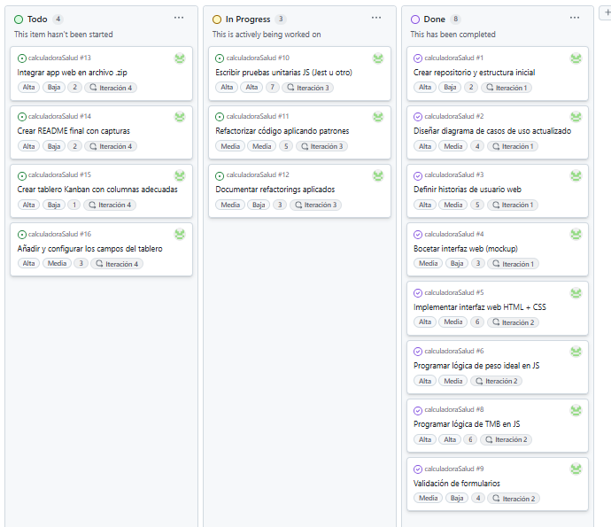

# Práctica 8 - Calculadora de Salud Web

Este repositorio contiene el desarrollo de la **Práctica 8** del proyecto de Ingeniería del Software Avanzada.  
Se ha adaptado la calculadora de salud desarrollada en prácticas anteriores para convertirla en una aplicación web destinada al Hospital Universitario Virgen del Rocío de Sevilla.

## Miembros del grupo

- Lucía Jiménez Vega  

## Descripción del proyecto

Este proyecto reutiliza el trabajo realizado en las Prácticas 1 a 7 (cálculo de peso ideal, TMB, interfaz gráfica, tests, refactorings y patrones de diseño) para planificar y desarrollar una versión web de la calculadora.

Se ha aplicado una **metodología ágil** con gestión de tareas en GitHub Projects (tablero Kanban), incluyendo:
- 15 tareas definidas como issues
- Campos personalizados: prioridad, dificultad, esfuerzo, iteración
- Asignación de responsables, etiquetas y milestones
- Distribución por columnas (`Todo`, `In Progress`, `Done`)

> Todas las tareas aparecen marcadas como completadas (`Done`) porque reflejan el trabajo realizado durante el desarrollo completo de las prácticas anteriores.

## Captura del tablero Kanban (Práctica 8)

A continuación se muestra una captura del tablero Kanban con la planificación y seguimiento del proyecto:

